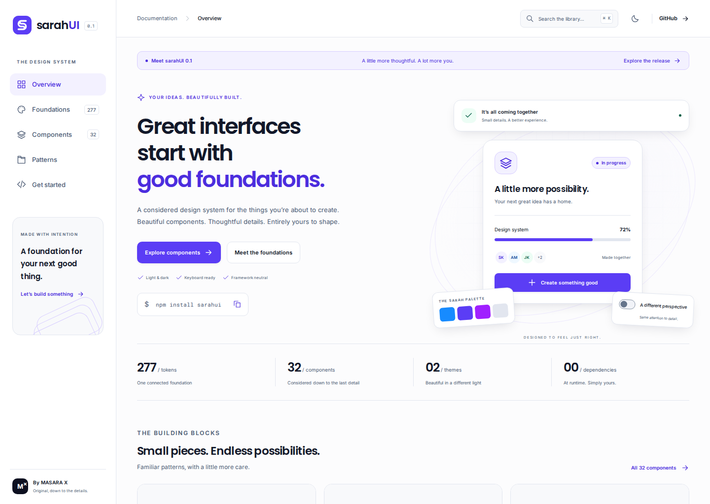

<strong>sarahUI</strong> Thoughtful by design. An original design system by MASARA X

sarahUI is a foundation-first UI system with an original blue, indigo, and violet identity. It includes reusable native HTML templates, CSS components, an ES-module interaction layer, and an interactive documentation application.

[Dark theme](docs/previews/overview-dark.png) · [Mobile](docs/previews/overview-mobile.png) · [Components](docs/previews/components-light.png) · [Foundations](docs/previews/foundations-light.png) · [Workspace pattern](docs/previews/patterns-light.png) · [Installation guide](docs/previews/getting-started-light.png)

- **277 token entries:** 85 primitive colors, 48 semantic roles in each theme, layout, typography, motion, layers, grid, and component aliases.
- **32 component families**, with keyboard interactions and explicit states.
- **Light, dark, and system preferences**, with inherited CSS custom properties.
- **15 text styles**, self-hosted fonts, Bengali and Arabic support.
- **Zero runtime dependencies.** Use the CSS in any framework, or compose HTML templates directly.
- Working project workspace and settings examples, token explorer, command search, and copyable component markup.

## Install the library

~~~sh
npm install sarahui
~~~

~~~js
import 'sarahui/css';
import { Button, render, enhanceUI } from 'sarahui';

// Add 

 to your HTML.
document.querySelector('#app').innerHTML = render(
  Button({ label: 'Create project', icon: 'plus' })
);
const cleanup = enhanceUI(document);
~~~

The package includes fonts, design tokens and TypeScript definitions.
Use the CSS classes with React, Vue or Blade, or use the native HTML template
functions directly. The templates are not JSX components.

## Run the documentation locally

Requires Node.js 22 or newer. No package install is required to build or serve the project.

~~~sh
git clone https://github.com/masarax/sarahui.git
cd sarahui
npm run dev
~~~

Open **http://localhost:4173**. The command builds and serves the documentation. Run it again after source changes; the server does not watch files.

~~~sh
npm run tokens       # validate and regenerate design variables
npm run build        # build static documentation and distributable files
npm test             # foundation, contrast, and template tests
npm run check        # build and run the unit tests
~~~

Browser verification:

~~~sh
npm ci
npx playwright install chromium
npm run test:browser
npm run test:package   # install the tarball in a fresh project and type-check
npm run test:deploy    # deployment configuration and upload safeguards
~~~

GitHub Actions verifies the build, components, browser behavior, package installation,
TypeScript declarations and deployment script. It provides **sarahui-documentation**,
**sarahui-browser-results** and **sarahui-package** artifacts. Successful main runs
publish the verified npm tarball through `NPM_TOKEN`. cPanel deployment stays
inactive until its FTP secrets are configured; see the [deployment guide](docs/deployment.md).

## Use the components

For a bundler, import `sarahui/css` once. For manual static integration, build
the repository and copy `dist/ui/` and `dist/assets/`, preserving their relative structure.

~~~html
<link rel="stylesheet" href="./ui/fonts.css">
<link rel="stylesheet" href="./ui/tokens.css">
<link rel="stylesheet" href="./ui/styles.css">
<main class="s-ui" id="app"></main>
~~~

~~~js
import { Button, html, render, enhanceUI } from './ui/index.js';

document.querySelector('#app').innerHTML = render(html`
  <section aria-label="Project actions">
    ${Button({ label: 'Create project', icon: 'plus' })}
  </section>
`);
const dispose = enhanceUI(document);
// Call dispose() when your application unmounts.
~~~

Interpolated text is escaped. Use `html` to compose trusted markup; keep untrusted content in interpolated values. The library does not fetch data or implement backend services. Connect component events to application state.

The public package is `sarahui`; the private root project is `sarahui-workspace`.
To generate a local installation tarball, run `npm ci` followed by `npm run pack:ui`.
The verified archive appears in `artifacts/npm/`.

## Component inventory

| Category | Families |
| --- | --- |
| Actions | Button, IconButton, ButtonGroup |
| Forms | Input, Textarea, Select, Checkbox, Radio, Switch, Slider |
| Display | Icon, Badge, Chip, Avatar, Card, DataTable, Separator |
| Navigation | Tabs, Breadcrumb, Pagination, NavItem, Accordion, Menu, CommandPalette |
| Feedback | Alert, Dialog, Tooltip, Progress, Skeleton, EmptyState, Spinner, Toast |

## Foundation architecture

Edit **`tokens/sarah.tokens.json`**, then run `npm run tokens`.

1. Primitive colors hold explicit values.
2. Semantic roles give values a purpose in each theme.
3. Component aliases connect shape, spacing, and sizing to the shared foundation.
4. Component styles consume the generated variables.

Generated outputs are checked in. CI verifies reproducibility.

~~~js
import { setTheme } from './ui/index.js';
setTheme('dark'); // 'light', 'dark', or 'system'
~~~

## Guides

- [Foundation specification](docs/foundations.md)
- [Component API and events](docs/components.md)
- [React and Laravel integration](docs/integration.md)
- [npm publishing and cPanel deployment](docs/deployment.md)
- [Accessibility and verification](docs/accessibility.md)
- [Recorded verification and previews](docs/verification.md)
- [Third-party font notices](THIRD_PARTY_NOTICES.md)

| Path | Purpose |
| --- | --- |
| `tokens/` | Source and generated CSS, JSON, TypeScript theme exports |
| `packages/ui/src/` | Templates, interactions, CSS, and types |
| `packages/ui/assets/fonts/` | Self-hosted fonts and OFL notices |
| `apps/docs/` | Interactive documentation and examples |
| `scripts/` | Token generation, build, and local server |
| `tests/` | Foundation, template, and browser verification |
| `dist/` | Generated documentation, excluded from Git |

The library is [MIT licensed](LICENSE). Project identity and original branding belong
to **MASARA X**. Bundled fonts retain their respective SIL Open Font Licenses.
